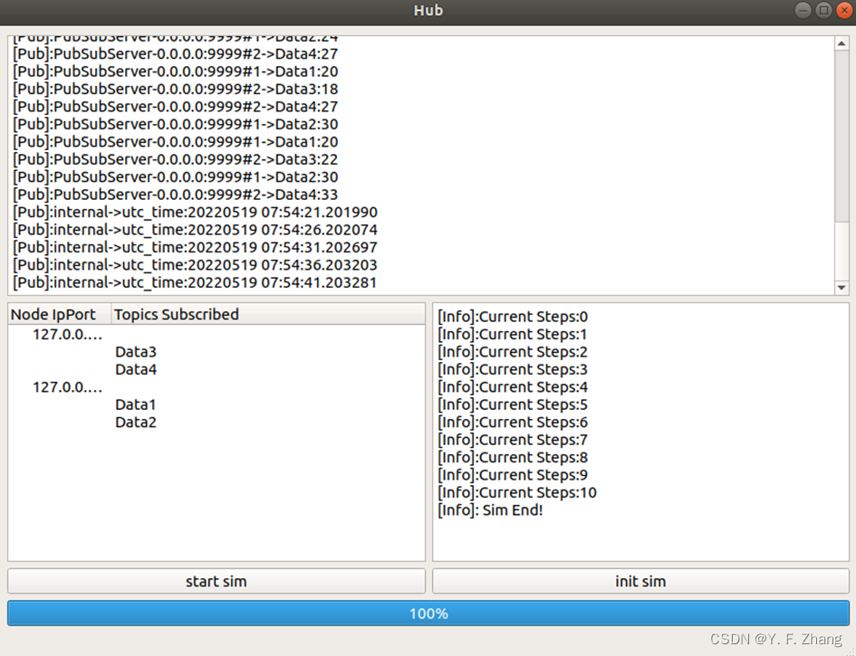
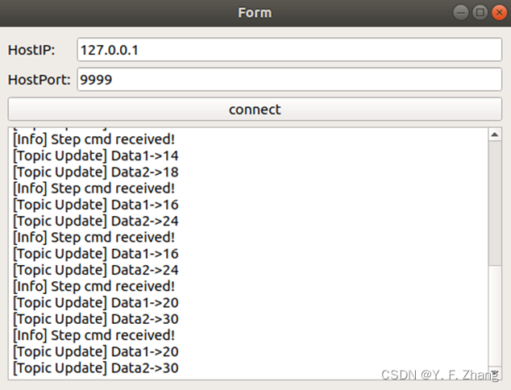

# 关于本项目

本项目基于Muduo网络库实现Linux下分布式仿真系统。之后会持续更新，目前完成了一些分布式仿真的基本功能。

# 项目效果展示


## 管理节点

1. 日志显示栏
2. 仿真节点IP Port显示，订阅话题显示
3. 仿真显示栏
4. 开始按钮和初始化仿真节点按钮
   

## 仿真节点（客户节点）

1. 填入管理节点IP和Port后向管理节点进行连接；
2. 日志显示栏显示日志信息；
   

# 项目配置

项目依赖Muduo网络库：https://github.com/chenshuo/muduo ，以及QT5。这二者的安装较为简单，不再赘述。另外,消息的传输采用JSON,依赖库Jsoncpp.

测试系统：Ubuntu18.04

## qmake编译

进入ElegantDISManager或者ElegantDISClient下build文件夹，执行：

```shell
qmake .. 
make debug
```

完成编译。

## IDE编译

IDE采用vscode，用qtcreator也可以。

若用vscode，打开项目下的ElegantDISManager或者ElegantDISClient后配置 .vscode目录下的json（正常来说不需要修改），之后用vscode gdb模式编译运行即可。

# 项目原理

总体逻辑图如下:


项目基于Muduo网络库，受其中examples/hub代码启发，正巧实验室只有Win下的分布式系统，想自己开发一个Linux下的。

1. 客户端采用QT搭建，主线程负责显示，子线程用于网络监听和一系列指令接受与发布逻辑；
2. 客户节点通过回调绑定设置仿真步进函数和初始化函数；
3. 管理节点向已注册的节点发布步进命令和初始化命令（目前只支持这两种操作）；
3. 由于Topic的数据格式可能会较为复杂,因此统一采用JSON格式传递;

**仿真同步逻辑（该DIS系统的核心思想）:**
对于仿真节点，其在步进函数中需要做的是将订阅话题的数据用于输入，计算得到需要发布话题的新值。之后向管理节点发布`stepover`指令，管理节点设置变量记录当前仿真步接受到`stepover`的节点数量，当数量等于所注册的节点数量时，管理节点发布`synpub`指令给所有仿真节点，仿真节点接收到该指令后将需要发布的话题值发布，通过管理节点转送到订阅该话题的节点，节点更新订阅话题的值，同时节点需要记录每一步仿真中订阅话题已更新数量，当所有订阅话题都被更新后，仿真节点向管理节点发布`synpubover`指令。管理节点统计每一仿真步中接受到`synpubover`的数量，当其等于所注册节点数量时，说明所有节点都完成话题更新了，此时再次向所有节点发布step指令进行下一步仿真。该逻辑保证了仿真的同步和时序的正常。
逻辑：所有节点先仿真一步->所有节点发布话题新值->所有节点更新话题值->下一步仿真。如果在step过程中又pub，时序会混乱。

对于管理节点，其需要记录注册仿真节点的各种信息。由于Muduo网络库是基于事件触发的，下面给出当管理节点收到消息后的处理函数:

```Cpp
void PubSubServer::onMessage(const TcpConnectionPtr& conn, Buffer* buf, Timestamp receiveTime) {
    ParseResult result = kSuccess;
    while (result == kSuccess) { 
        string cmd;
        string topic;
        string content;
        result = parseMessage(buf, &cmd, &topic, &content); // 对buf中收到的字节流进行处理
        if (result == kSuccess) { // 处理到一个满足格式要求的指令
            if (cmd == "pub") {  // 如果指令是客户节点的发布指令
                doPublish(conn->name(), topic, content, receiveTime);
            }
            else if (cmd == "sub") { // 如果指令是客户节点的订阅指令
                doSubscribe(conn, topic);
            }
            else if (cmd == "unsub") { // 如果指令是客户节点的退订指令
                doUnsubscribe(conn, topic);
            }
            else if (cmd == "stepover") { // 如果指令是客户节点完成一步仿真指令
                emit step_over_sig(); // 发送信号使主线程采取相应动作
            }
            else if (cmd == "initover") {
                // todo
                // emit init_over_sig();
            }
            else if (cmd == "synpubover") {
                emit synpub_over_sig();
            }
            else {
                conn->shutdown(); // 否则关闭连接
                result = kError;
            }
        }
        else if (result == kError) {
            conn->shutdown();
        }
    }
}
```

对于仿真节点，当有消息到来时的处理函数：

```Cpp
void PubSubClient::onMessage(const TcpConnectionPtr& conn, Buffer* buf, Timestamp receiveTime) {
    ParseResult result = kSuccess;
    while (result == kSuccess) {
        string cmd;
        string topic;
        string content;
        result = parseMessage(buf, &cmd, &topic, &content);
        if (result == kSuccess) {
            if (cmd == "pub" && subscribeCallback_) {
                subscribeCallback_(topic, content, receiveTime);
            }
            if (cmd == "step") {
                emit log_msg(QString("[Info] Step cmd received!"));
                stepCallback_();
                send("stepover\r\n");
            }
            if (cmd == "init") {
                emit log_msg(QString("[Info] Init cmd received!"));
                initCallback_();
                send("initover\r\n");
            }
            if (cmd == "synpub") {
                emit synpub_sig();
            }
        }
        else if (result == kError) {
            conn->shutdown();
        }
    }
}
```

可以看到，当接收到step或者init命令时，程序将执行上层注册的回调函数。并向管理节点发布over指令。其中emit是为了让qt主线程相应并显示相关日志信息。